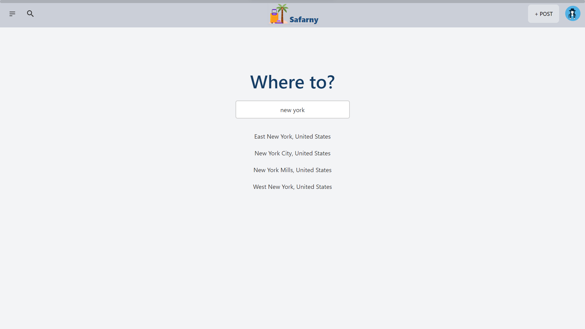
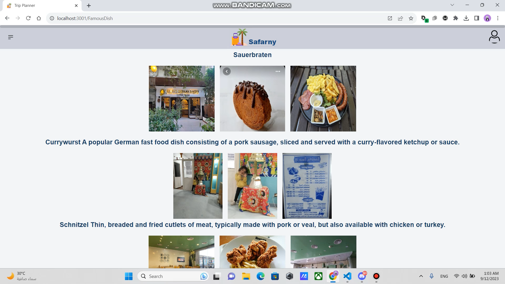
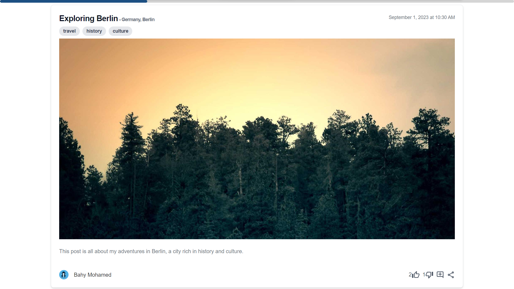
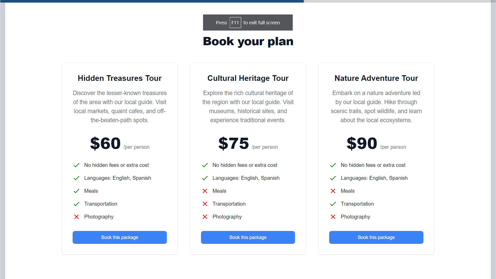
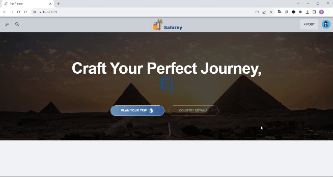
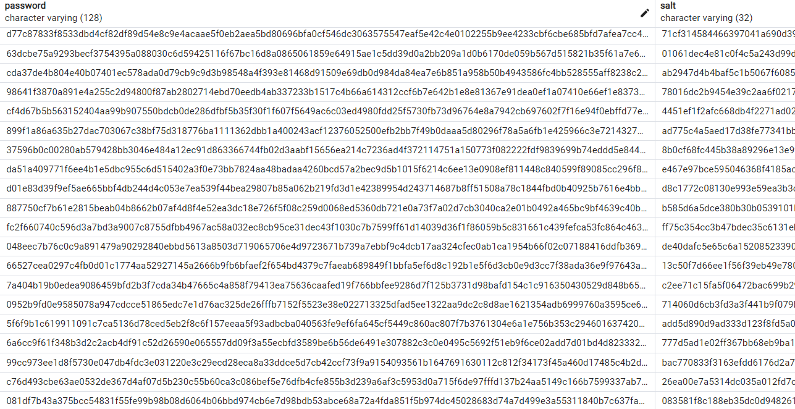

<html>
<h1>Safarny</h1>
   
       <h4>Frontend Reposiery <a href="https://github.com/bahylol/Safarny-Frontend" target="_blank">Here</a></h4>
       <h4>Note: This project was developed in Itworx repositories, so the commits cannot be public.</h4>
   <h3></h3>
       <h2>Demo</h2>
        <h4>You can watch a walkthrough of the website from <a href="https://drive.google.com/file/d/18VdgxDEaHJ2oibYYGKSS3dxqsTceI0cj/view?usp=sharing" target="_blank">Here</a></h4>
    <h2>
    Table of contents
    </h2>
    <h3> 
        <ul>
            <li>Project Title</li>
            <li>Demo</li>
            <li>Table of contents</li>
            <li>Description</li>
            <li>Usage</li>
            <li>.env.example</li>
            <li>List of Features</li>
            <li>Preview</li>
            <li>Contributers</li>
        </ul>
    </h3>
    <br>
    <h2>Description</h2>
    <h4>
    Safarny is an innovative project designed to transform the way you plan and experience your trips. Powered by the robust PERN stack, Azure AI APIs, Google Maps API, and Stripe, this online platform introduces a host of features to optimize your travel adventures. Safarny's key features include intelligent trip planning based on budget, time constraints, and interests using artificial intelligence, as well as flexible trip customization, traveler-generated ratings and reviews, a real-time map with activity integration, and a personalized news feed page to keep you informed and connected with fellow travelers. Other features include a trip assistance chatbot, currency converter, dish suggestions, and the ability to connect with local guides for authentic experiences. Safarny leverages React.js for the front-end, Node.js & Express.js for the back-end, and PostgreSQL for efficient data management.
    </h4>
    <h2>Usage</h2>
    <h3><ol>
            <li>Clone this project</li>
            <li>Download Postgres and PGadmin</li>
            <li>Create a new databse in PGadmin then navigate to db.js and enter your database configuration</li>
            <li>Navigate to rerun_DB.sql and run the sql queries using PGadmin</li>
            <li>Open terminal in the project folder then run npm i command</li>
            <li>Clone the Front End files from this repo : <a href="https://github.com/bahylol/Safarny-Frontend" target="_blank">Link</a></li>
            <li>Open terminal in the front end project folder then run npm i command</li>
            <li>Make a .env file and use the .env.example</li>
            <li>Run npm start in the backend folder then the frontend folder and wait a min or two</li>
            <li>Enter in your browser http://localhost:3001/</li>
        </ol></h3>
    <h2>.env.example</h2>
    ```POSTGRES_URL=
JWT=
FRONTEND="http://localhost:3000"
AZUERAPIKEY =
ENDPOINT = 
GOOGLEMAPSAPIKEY = 
BACKENDURL="3001"
CLOUDINARYAPIKEY=
CLOUDINARYSCREETAPIKEY=
SREPAPI=
SEND_GRID_KEY=

    ```
    <h2>List of Features</h2>
        <ul>
            <li>Responsive Design</li>
            <li>Dark and light mode supported</li>
            <li>intelligent trip planning using AI.</li>
            <li>Google Maps API for Showing locations of places </li>
            <li>Printing trip details</li>
            <li>Chat Bot</li>
            <li>Dish suggestions</li>
            <li>Currency Converter</li>
            <li>Personalized news feed page</li>
            <li>Reviews and Ratings</li>
            <li>Payments with Stripe API</li>
            <li>Forget password Feature</li>
            <li>Passwords salted and hashed in the databse</li>
        </ul>
    <h2>Preview</h2>
    <br>
    <h3>Plan example</h3>
    <br>
    
    
    
    
    <br>
    
    <br>
    <br>
    
    <br>
    <br>
    
    <br>
    <h3>Map with location</h3>
    <br>
    
    <br>
    <h3>Chat Bot</h3>
    <br>
    
    <br>
    <h3>Dish suggestions</h3>
    <br>
    
    <br>
    <h3>Currency Converter</h3>
    <br>
    
    <br>
    <h3>Personalized news feed page</h3>
    <br>
    
    <br>
    <h3>Reviews and Ratings</h3>
    <br>
    
    <br>
    <h3>Stripe Payment</h3>
    <br>
    
    <br>
    
    <br>
    <h3>Traveler Profile</h3>
    <br>
    
    <br>
    <h3>Responsivness</h3>
    <br>
    
    <br>
    <h3>Dark and light mode supported</h3>
    <br>
    
    <br>
    <h3>Hashed and Salted passwords</h3>
    <br>
    
    <br>
    <h2>Contributers</h2>
        <ul>
            <li>Ahmed Yehia <a href="https://github.com/AhmedHosny2" target="_blank">Github</a> <a href="https://www.linkedin.com/in/ahmed-yehia-155629206/" target="_blank">Linkedin</a></li>
            <li>Bahy Mohamed <a href="https://github.com/bahylol" target="_blank">Github</a> <a href="https://www.linkedin.com/in/bahy-salama/" target="_blank">Linkedin</a></li>
            <li>Eyad Hassan <a href="https://github.com/EyadTamer999" target="_blank">Github</a> <a href="https://www.linkedin.com/in/eyad-hassan-a31b4a237/" target="_blank">Linkedin</a></li>
            <li>George Mounir <a href="https://github.com/Lofffy" target="_blank">Github</a> <a href="https://www.linkedin.com/in/george-mounir-83546b230/" target="_blank">Linkedin</a></li>
            <li>Youssef Elwy <a href="https://github.com/youfiElwy" target="_blank">Github</a> <a href="https://www.linkedin.com/in/youssef-elwy-427682268/" target="_blank">Linkedin</a></li>
        </ul>
</html>
